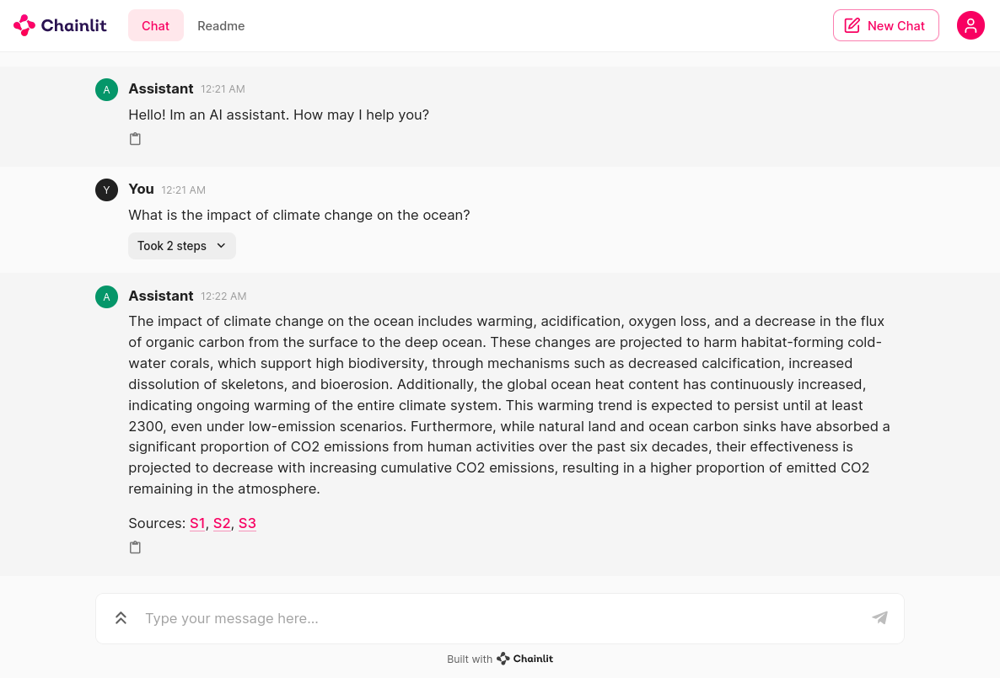

# Pinecone

Using Pinecone Vector DB, there are some new changes to both the `ingest.py` and `main.py`, the first time you use ingest your documents, uncomment `pc.create_index()`, this will create your pinecone index(make sure you add your pinecone key to .env first). Next time you ingest documents, comment pc.create_index().

You will also see a new IngestionPipeline and some commented extractors, you can uncomment them and use them. Each will add a expecific metadata to your vectors.

Finally I changed the embedding model and the llm to "text-embedding-3-large", "gpt-4-0125-preview". If you use another embedding model, make sure you change the dimensions of the db in ingestion accordingly. For example, text-embedding-ada-002 uses 1536.


## Installation Instructions

Follow these steps to set up the GPT Documents chatbot on your local machine:

1. Create a conda environment:

   ```shell
   conda create -n rag python==3.11 -y && source activate rag
   ```

2. Install the required dependencies:

   ```shell
   pip install -r requirements.txt
   ```

3. Load your documents into the vector store by: 
    - Create a folder named 'data'.
    - Place your documents inside the 'data' folder.
    - Execute the 'ingest.py' script to initiate the loading process.

## Usage

Once the setup is complete, launch the chainlit app using the following command:

```shell
chainlit run -w main.py
```

Feel free to explore the functionalities and contribute to the development of this project. Your feedback and contributions are highly appreciated!
