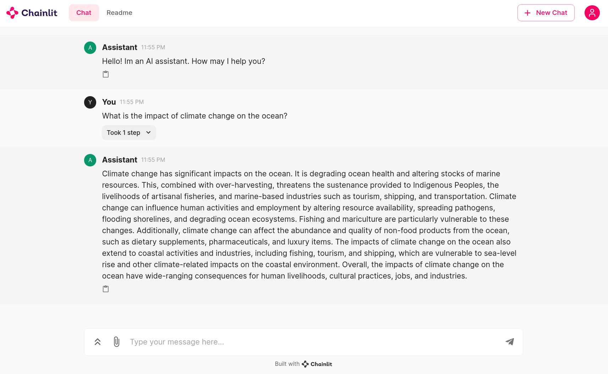

# Basic GPT Documents

Welcome to GPT Documents, a basic OpenAI document chatbot powered by llama index and chainlit. This project serves as a foundation, and we plan to enhance its capabilities in subsequent iterations.



## Installation Instructions

Follow these steps to set up the GPT Documents chatbot on your local machine:

1. Create a conda environment:

   ```shell
   conda create -n rag python==3.11 -y && source activate rag
   ```

2. Install the required dependencies:

   ```shell
   pip install -r requirements.txt
   ```

3. Load your documents into the vector store by placing them in the 'data' folder and running the 'ingest.py' program.

**Note**: Create a .env file and add your OpenAI API key as 'OPENAI_API_KEY="sk-..."'

## Usage

Once the setup is complete, launch the chainlit app using the following command:

```shell
chainlit run -w main.py
```

Feel free to explore the functionalities and contribute to the development of this project. Your feedback and contributions are highly appreciated!
